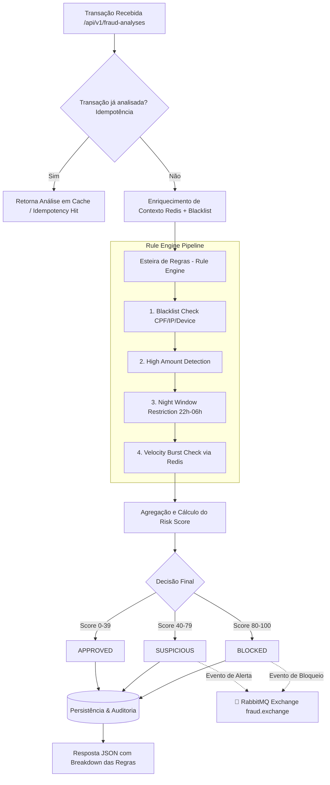

# 🛡️ Fraud Detection & Risk Engine API

Uma **API corporativa de alta performance** para análise de risco e prevenção a fraudes em transações financeiras (PIX, Cartão de Crédito, Débito e Boletos) em tempo real.

Desenvolvida com **Java 21**, **Spring Boot 3**, e arquitetura baseada em **Rule Engine Pipeline (Pipeline de Regras Extensível)**, garantindo auditoria completa, baixa latência e total conformidade com padrões de mercado de Fintechs e Instituições de Pagamento.

---

## 🚀 Funcionalidades Principais

- **Motor de Regras Antifraude (Rule Engine):**
  - 🚫 **Blacklist Restritiva:** Bloqueio instantâneo (Score 100) para CPFs, IPs e Device Fingerprints reincidentes em fraudes.
  - 💸 **High Amount Detection:** Detecção de valores anômalos com pontuações proporcionais à gravidade.
  - 🌙 **Janela Noturna de Risco:** Regras estritas para transações de alto valor entre 22h e 06h (mitigação de sequestro relâmpago e fraudes no PIX).
  - ⚡ **Velocity Burst Check:** Detecção de rajadas de tentativas consecutivas com **Redis Sliding Window Cache** e fallback resiliente para banco relacional.
- **Idempotência de Transações:**
  - Detecção de requisições duplicadas via `transactionId` com retorno imediato do veredito sem reprocessamento desnecessário (`idempotencyHit: true`).
- **Arquitetura Orientada a Eventos (RabbitMQ):**
  - Publicação assíncrona de eventos de risco (`FraudAlertEvent`) para a exchange `fraud.exchange` em caso de transações `BLOCKED` ou `SUSPICIOUS`.
- **Cálculo de Risk Score (0 a 100):**
  - `0 - 39`: **APPROVED** (Aprovada)
  - `40 - 79`: **SUSPICIOUS** (Suspeita — encaminhada para análise manual/biometria)
  - `80 - 100`: **BLOCKED** (Bloqueada por alto risco de fraude)
- **Segurança Inter-Microsserviços:** Autenticação por cabeçalho `X-API-KEY` com Spring Security e suporte nativo no Swagger UI.
- **Carga de Dados Inicial (Seed):** Inicialização com CPFs, IPs e aparelhos suspeitos pré-populados para testes imediatos.
- **Auditoria Completa & Métricas:** Histórico detalhado de cada regra avaliada e indicadores de capital protegido.

---

## 📐 Arquitetura do Sistema

---

## 🛠️ Stack Tecnológica

| Componente | Tecnologia |
| :--- | :--- |
| **Linguagem** | Java 21 LTS |
| **Framework** | Spring Boot 3.4.3 |
| **Segurança** | Spring Security 6 (API Key Authentication) |
| **Mensageria Assíncrona** | RabbitMQ (Event-Driven Architecture) |
| **Cache & Performance** | Redis 7 (Sliding Window Velocity Tracking) |
| **Persistência** | Spring Data JPA / Hibernate 6 |
| **Bancos de Dados** | H2 Database (Dev/Testes) & PostgreSQL 16 (Produção) |
| **Documentação** | Springdoc OpenAPI 3 (Swagger UI com Authorize) |
| **Containerização** | Docker & Docker Compose |
| **CI/CD** | GitHub Actions (Automated Build & Tests) |
| **Testes** | JUnit 5, Mockito, Spring Security Test |

---

## 📋 Endpoints Principais

### 1. Análises Antifraude (/api/v1/fraud-analyses)
- POST /api/v1/fraud-analyses: Submete uma transação para avaliação em tempo real.
- GET /api/v1/fraud-analyses/{id}: Consulta os detalhes e o detalhamento das regras de uma análise.
- GET /api/v1/fraud-analyses/customer/{customerId}: Histórico de análises de um cliente.

### 2. Blacklist Restritiva (/api/v1/blacklist)
- POST /api/v1/blacklist: Adiciona CPF, IP ou Device Fingerprint à lista de bloqueio.
- GET /api/v1/blacklist: Lista os registros ativos da blacklist.
- DELETE /api/v1/blacklist/{id}: Desativa um registro.

### 3. Métricas (/api/v1/metrics)
- GET /api/v1/metrics/overview: Indicadores consolidados de transações aprovadas, bloqueadas e capital protegido.

---

## 💻 Como Executar o Projeto

### Pré-requisitos
- JDK 21 instalado
- Git

### Opção 1: Executando com o Maven Wrapper (Em memória H2)
`ash
# Clone o repositório
git clone https://github.com/FelipeGardenghiDev/fraud-detection-api.git
cd fraud-detection-api

# Execute os testes automatizados
./mvnw test

# Inicie a aplicação
./mvnw spring-boot:run
`
> A aplicação iniciará na porta 8080.
> - **Swagger UI:** [http://localhost:8080/swagger-ui.html](http://localhost:8080/swagger-ui.html)
> - **H2 Console:** [http://localhost:8080/h2-console](http://localhost:8080/h2-console) (JDBC URL: jdbc:h2:mem:frauddetectiondb)

### Opção 2: Executando com Docker Compose (Com PostgreSQL)
`ash
docker compose up --build -d
`

---

## 🧪 Exemplo de Requisição (cURL)

`ash
curl -X POST http://localhost:8080/api/v1/fraud-analyses \
  -H "Content-Type: application/json" \
  -H "X-API-KEY: fraud-secret-key-2026" \
  -d '{
    "transactionId": "TX-2026-0987",
    "customerId": "CUST-1044",
    "customerCpf": "12345678900",
    "amount": 25000.00,
    "paymentMethod": "PIX",
    "ipAddress": "189.40.22.15",
    "deviceFingerprint": "dev-fp-xyz-99",
    "location": "São Paulo, SP",
    "occurredAt": "2026-09-09T23:30:00"
  }'
`

### Exemplo de Resposta:
`json
{
  "analysisId": "e1f37e40-5b12-4c28-98e3-08709d4351a9",
  "transactionId": "TX-2026-0987",
  "customerId": "CUST-1044",
  "riskScore": 95,
  "decision": "BLOCKED",
  "decisionDescription": "Transação bloqueada devido a alto risco de fraude.",
  "ruleBreakdown": [
    {
      "ruleName": "BLACKLIST_CHECK",
      "triggered": false,
      "scoreContribution": 0,
      "reason": "Regra não violada."
    },
    {
      "ruleName": "HIGH_AMOUNT_DETECTION",
      "triggered": true,
      "scoreContribution": 60,
      "reason": "Valor da transação (R$ 25000.00) atinge nível crítico (>= R$ 20000.00)."
    },
    {
      "ruleName": "NIGHT_WINDOW_RESTRICTION",
      "triggered": true,
      "scoreContribution": 35,
      "reason": "Transação noturna (23:30) de valor elevado (R$ 25000.00 > limite de R$ 1000.00)."
    },
    {
      "ruleName": "VELOCITY_BURST_CHECK",
      "triggered": false,
      "scoreContribution": 0,
      "reason": "Regra não violada."
    }
  ],
  "analyzedAt": "2026-09-09T15:25:00"
}
`

---

## 👨‍💻 Autor

Desenvolvido por **[Felipe Gonçalves](https://github.com/FelipeGardenghiDev)**  
Conecte-se comigo no [LinkedIn](https://linkedin.com) ou pelo GitHub!