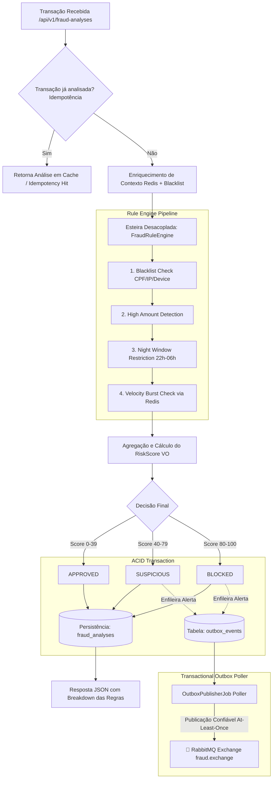

# 🛡️ Fraud Detection & Risk Engine API


[](https://github.com/FelipeGardenghiDev/fraud-detection-api/actions/workflows/ci.yml)
-success?logo=junit5)


Uma **API corporativa de alta performance** para análise de risco e prevenção a fraudes em transações financeiras (PIX, Cartão de Crédito, Débito e Boletos) em tempo real.

Desenvolvida com **Java 21**, **Spring Boot 3**, **Domain-Driven Design (DDD)**, **Transactional Outbox Pattern** e **Infraestrutura como Código (Terraform na AWS)**, garantindo resiliência em sistemas distribuídos, auditoria estrita, baixa latência e total conformidade com padrões de mercado de Fintechs e Instituições de Pagamento.

---

## 🚀 Funcionalidades Principais

- **Motor de Regras Antifraude (Rule Engine Pipeline):**
  - 🚫 **Blacklist Restritiva:** Bloqueio instantâneo (Score 100) para CPFs, IPs e Device Fingerprints reincidentes em fraudes.
  - 💸 **High Amount Detection:** Detecção de valores anômalos com pontuações proporcionais à gravidade.
  - 🌙 **Janela Noturna de Risco:** Regras estritas para transações de alto valor entre 22h e 06h (mitigação de sequestro relâmpago e fraudes no PIX).
  - ⚡ **Velocity Burst Check:** Detecção de rajadas de tentativas consecutivas com **Redis Sliding Window Cache** e fallback resiliente para banco relacional.
- **Resiliência Distribuída com Transactional Outbox Pattern:**
  - Elimina a perda de eventos em falhas de rede do broker de mensageria: a análise e o evento de alerta são persistidos na **mesma transação atômica ACID**.
  - Worker agendado (`OutboxPublisherJob`) realiza a entrega com retentativas controladas e transição para estado de falha/Dead-Letter (`FAILED`).
- **Domain-Driven Design (DDD) & Value Objects:**
  - `Cpf`: Validação rigorosa pelo algoritmo oficial Módulo 11 da Receita Federal e mascaramento LGPD (`***.456.789-**`).
  - `RiskScore`: Encapsulamento dos limites de pontuação (0 a 100) e cálculo da decisão correspondente.
  - `TransactionAmount`: Invariantes monetárias e operações de comparação financeira precisas.
  - `RuleSpecification`: Implementação do Specification Pattern permitindo composição lógica (`and`, `or`, `not`) de predicados antifraude.
- **Idempotência de Transações:**
  - Detecção de requisições duplicadas via `transactionId` com retorno imediato do veredito sem reprocessamento desnecessário (`idempotencyHit: true`).
- **Segurança Inter-Microsserviços:** Autenticação por cabeçalho `X-API-KEY` com Spring Security e suporte nativo no Swagger UI.
- **Auditoria Completa & Métricas:** Histórico detalhado de cada regra avaliada e indicadores consolidados de capital financeiro protegido.
- **Infraestrutura como Código (Terraform):** Especificação completa de nuvem na AWS com VPC, ECS Fargate, RDS PostgreSQL Multi-AZ, ElastiCache Redis e Amazon MQ RabbitMQ.

---

## 📐 Arquitetura do Sistema



---

## ☁️ Infraestrutura como Código (Terraform na AWS)

O projeto conta com uma especificação completa de infraestrutura corporativa na pasta [`terraform/`](./terraform), cobrindo:

* **Rede Isolada (VPC):** Subnets públicas (apenas para o ALB) e subnets privadas (para containers e bancos).
* **AWS ECS Fargate:** Cluster serverless para a aplicação Spring Boot com auto-scaling e health checks no `/actuator/health`.
* **Amazon RDS PostgreSQL:** Banco de dados relacional Multi-AZ em subnets privadas com criptografia em repouso.
* **Amazon ElastiCache Redis:** Cluster gerenciado para suporte de alto throughput na janela de velocidade (*Velocity Tracker*).
* **Amazon MQ RabbitMQ:** Broker de mensageria gerenciado na nuvem para eventos de alerta.
* **Segurança Encadeada:** Security Groups que permitem tráfego apenas entre camadas adjacentes (ALB ➔ ECS ➔ Bancos/Filas).

> 📖 **Consulte a documentação completa da infraestrutura em [`terraform/README.md`](./terraform/README.md).**

---

## 🛠️ Stack Tecnológica

| Componente | Tecnologia | Papel no Sistema |
| :--- | :--- | :--- |
| **Linguagem** | Java 21 LTS | Runtime moderno com Records, Pattern Matching e Virtual Threads |
| **Framework** | Spring Boot 3.4.3 | Núcleo do microsserviço (Data JPA, Security, Actuator) |
| **Padrões de Design** | DDD + Transactional Outbox + Specification | Resiliência distribuída, desacoplamento e modelo rico |
| **Infraestrutura** | Terraform (IaC) | Provisionamento automatizado e reproduzível na AWS |
| **Mensageria** | RabbitMQ (Spring AMQP) | Publicação assíncrona orientada a eventos (`FraudAlertEvent`) |
| **Cache & In-Memory** | Redis 7 | Janela de contagem de velocidade deslizante (*Sliding Window*) |
| **Persistência** | PostgreSQL 16 & H2 | H2 em memória para testes velozes; PostgreSQL para produção |
| **Cobertura de Testes**| JaCoCo + JUnit 5 + Mockito | **32 testes automatizados (100% passing)** com relatório de cobertura |
| **Documentação** | OpenAPI 3 / Swagger | Interface interativa com suporte a autenticação `X-API-KEY` |
| **CI/CD** | GitHub Actions | Validação de build Maven, execução de testes e lint de Terraform |

---

## 📋 Endpoints Principais

### 1. Análises Antifraude (`/api/v1/fraud-analyses`)
- `POST /api/v1/fraud-analyses`: Submete uma transação para avaliação em tempo real.
- `GET /api/v1/fraud-analyses/{id}`: Consulta os detalhes e o detalhamento das regras de uma análise.
- `GET /api/v1/fraud-analyses/customer/{customerId}`: Histórico de análises de um cliente.

### 2. Blacklist Restritiva (`/api/v1/blacklist`)
- `POST /api/v1/blacklist`: Adiciona CPF, IP ou Device Fingerprint à lista de bloqueio.
- `GET /api/v1/blacklist`: Lista os registros ativos da blacklist.
- `DELETE /api/v1/blacklist/{id}`: Desativa um registro.

### 3. Métricas (`/api/v1/metrics`)
- `GET /api/v1/metrics/overview`: Indicadores consolidados de transações aprovadas, bloqueadas e capital protegido.

---

## 💻 Como Executar o Projeto Localmente ($0 de Custo)

### Pré-requisitos
- JDK 21 ou superior instalado
- Git

### Opção 1: Executando com o Maven Wrapper (Em memória H2)
```bash
# Clone o repositório
git clone https://github.com/FelipeGardenghiDev/fraud-detection-api.git
cd fraud-detection-api

# Execute com o perfil de desenvolvimento
./mvnw spring-boot:run
```

Acesse o Swagger UI em: `http://localhost:8080/swagger-ui.html`

### Opção 2: Executando com Docker Compose (PostgreSQL + Redis + RabbitMQ)
```bash
docker compose up -d
```

### Opção 3: Executar a Suíte de Testes e Gerar Relatório JaCoCo
```bash
./mvnw clean test
```
O relatório HTML detalhado de cobertura será gerado em: `target/site/jacoco/index.html`.

---

## 👨‍💻 Autor

Desenvolvido por **[Felipe Gardenghi](https://github.com/FelipeGardenghiDev)**  
Conecte-se comigo no [LinkedIn](https://www.linkedin.com/in/felipegardenghi/) ou pelo [GitHub](https://github.com/FelipeGardenghiDev)!