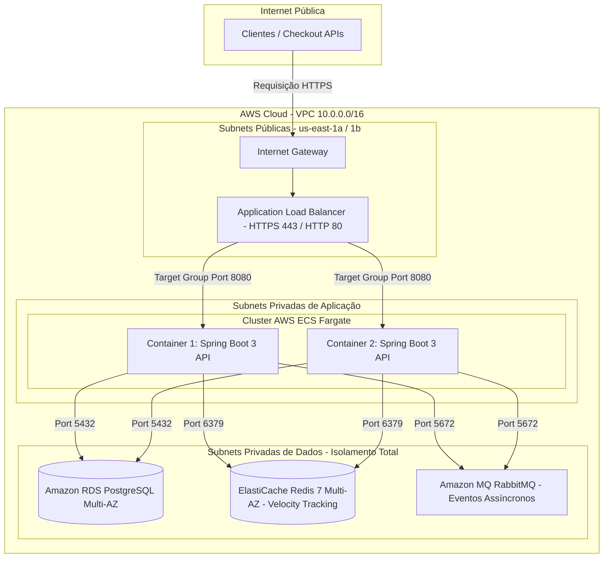

# ☁️ AWS Cloud Infrastructure with Terraform (IaC)

Este diretório contém a especificação completa de **Infraestrutura como Código (IaC)** para implantação da **Fraud Detection & Risk Engine API** na Amazon Web Services (AWS), projetada sob as melhores práticas do **AWS Well-Architected Framework** e conformidade com requisitos de segurança de fintechs/bancos (PCI-DSS e LGPD).

---

## 🏛️ Topologia de Arquitetura em Nuvem



---

## 🛡️ Pilares de Segurança & Isolamento

1. **Zero Exposição Pública para Dados e Containers:**
   * Apenas o **Application Load Balancer (ALB)** reside em subnets públicas.
   * Os containers **ECS Fargate**, o banco de dados **RDS**, o cache **Redis** e o broker **RabbitMQ** estão confinados exclusivamente em **subnets privadas** sem IP público.
2. **Security Groups Encadeados (Least Privilege):**
   * O Security Group do ECS só aceita requisições originadas do Security Group do ALB.
   * Os Security Groups do RDS, Redis e RabbitMQ aceitam tráfego **apenas** do Security Group das tasks do ECS.
3. **Alta Disponibilidade (Multi-AZ):**
   * RDS com réplica síncrona Multi-AZ para failover automático.
   * ElastiCache Redis distribuído em múltiplos nós com *automatic failover*.
   * ECS Service configurado com `desired_count = 2` distribuído entre zonas `us-east-1a` e `us-east-1b`.
4. **Health Check Resiliente:**
   * O ALB monitora o endpoint `/actuator/health` do Spring Boot com verificação ativa a cada 30 segundos.

---

## 📂 Estrutura Modular dos Arquivos

```text
terraform/
├── main.tf                    # Orquestrador central e composição dos módulos
├── variables.tf               # Variáveis parametrizáveis e valores padrão
├── outputs.tf                 # URLs públicas, endpoints de banco e identificadores
├── terraform.tfvars.example   # Modelo de variáveis para preenchimento
└── modules/
    ├── vpc/                   # VPC, Subnets Públicas/Privadas, IGW e Tabelas de Roteamento
    ├── security/              # Security Groups encadeados e Roles IAM (ECS Task/Execution)
    ├── rds/                   # Amazon RDS PostgreSQL 16 Multi-AZ
    ├── redis/                 # Amazon ElastiCache Redis 7 com failover
    ├── rabbitmq/              # Amazon MQ gerenciado para RabbitMQ
    └── ecs/                   # Cluster ECS Fargate, Task Definition, Service e ALB
```

---

## 🚀 Como Validar e Executar Gratuitamente ($0)

Você **não precisa de conta ativa na AWS nem de cartão de crédito** para validar essa infraestrutura:

### 1. Validação Sintática e de Boas Práticas (Local ou CI/CD)
```bash
# 1. Inicializa os módulos sem configurar backend remoto
terraform init -backend=false

# 2. Valida se a sintaxe e as referências entre módulos estão 100% corretas
terraform validate

# 3. Verifica a formatação do código HCL
terraform fmt -check -recursive
```

### 2. Validação Automatizada no GitHub Actions
Toda alteração neste diretório é testada automaticamente no fluxo de CI do GitHub Actions (`.github/workflows/ci.yml`), garantindo que o código de infraestrutura permaneça sempre validado e pronto para produção.
